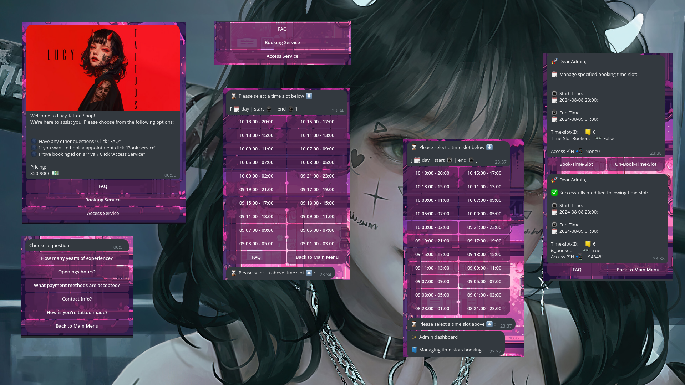
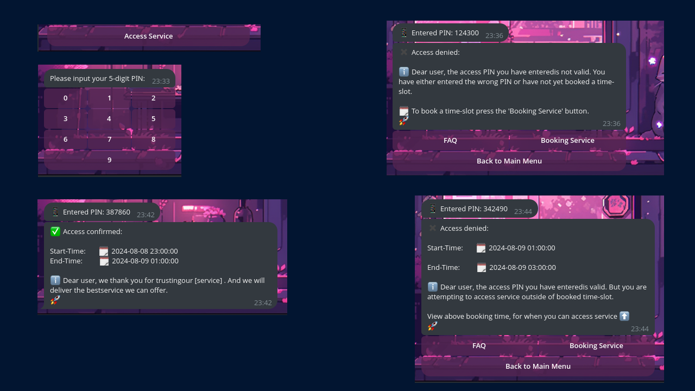

# Managing bookings and access for any specified service via telegram
Telegram Bot for any service requiring booking's and user authentication on arrival. Currently I have modified the code to work for a tattoo-shop
as a example.

- **Maximum Booking Horizon:** 46 hours in advance.
- **Minimum Booking Horizon:** 0 hours in advance.
- **Standard Booking Slot** 2 hour long window

**This approach is fully automatic, meaning:**
- When a time slot expires (i.e., its `end_time` is earlier than the current time), it is removed from the `time_slots` table, ensuring it is not displayed to users.
- The population of time slots occurs every hour, ensuring that new time slots are continuously generated, maintaining availability for booking up to 46 hours in advance.

## Features:
-   Main Menu ✅
-   Button Interaction Only ✅
-   FAQ within Menu ✅
-   User booking time-slot dasboard ✅
-   Admin manegement dashboard for all available booking ✅
    - Booking any specified time-slot ☑️
    - Un-booking any specified time-slot ☑️
    - Returns 5 digit PIN when booking time-slot ☑️
    - Unique password cmd for access dashboard via chat message ☑️
        - *Password is set within 'settings.py'* 
-   User 5 digit PIN authentication dasboard ✅
    - authenticating booking on arrival ☑️
    - Accepts or rejects access ☑️
    - Authentication message response based on entered PIN  ☑️
        - *pin is returned to admin after confirming booking* 
    - ```
      user_access_auth_return_data = {
                    'pin_valid': pin_valid,
                    'pin_inside_time_slot': pin_inside_time_slot,
                    'pin_outside_time_slot': pin_outside_time_slot,
                    'start_time': start_time,
                    'end_time': end_time
    
                }
      ```
-   Only available during openings-hours ✅
-   asynchronous  ✅
-   Database ✅
-   Handles unexpected message ✅
    -   *Displays the start_menu command to press*





## Table of Contents

1. [Managing Bookings and Access for Any Specified Service via Telegram](#managing-bookings-and-access-for-any-specified-service-via-telegram)
2. [Features](#features)

4. [Installation](#installation)
   - [Cloning Git Repository](#cloning-git-repository)
   - [Getting API Key from BotFather](#getting-api-key-from-botfather)
   - [Works out of the box](#works-out-of-the-box)

5. [Understanding Code Layout](#understanding-code-layout)
   - [Directory Layout](#directory-layout)
   - [Summary](#summary)

6. [Database Schema](#database-schema)
   - [Database Schema Visualized](#database-schema-visualised)
   - [`init-db.spql`](#init-dbspql)
   - [Interacting with the Database Asynchronously Without Blocking](#interacting-with-the-database-asynchronously-without-blocking)
     - [How `DependencyContainer` and `initialize_connection_pool` Work Together](#how-dependencycontainer-and-initialize_connection_pool-work-together)
     - [Imports Used](#imports-used)

   - [Understanding Usage of Tables](#understanding-usage-of-tables)
     - [`time_slots` Table](#time_slots-table)
         - [Functions Utilizing `time_slots` Table](#functions-utilizing-time_slots-table)
            - [populate_time_slots](#1-populate_time_slots)
            - [fetch_all_available_time_slots](#2-fetch_all_available_time_slots)
            - [fetch_time_slot_row_by_id](#3-fetch_time_slot_row_by_id)
            - [fetch_all_time_slots](#4-fetch_all_time_slots)
            - [manage_booking_time_slots](#5-manage_booking_time_slots)
            - [check_user_access_by_access_pin](#6-check_user_access_by_access_pin)

     - [`pins` Table](#pins-table)
        - [Functions Utilizing `pins` Table](#functions-utilizing-pins-table)
            - [fetch_user_entered_access_pin_stored_db](#1-fetch_user_entered_access_pin_stored_db)
            - [insert_or_update_user_entered_access_pin_db](#2-insert_or_update_user_entered_access_pin_db)
            - [delete_user_entered_access_pin_db](#3-delete_user_entered_access_pin_db)

7. [CallbackQuery Handlers](#callbackquery-handlers)
    - **[Start Callback Data Handler](#handle_start_callback)**
    - **[FAQ Callback Data Handlers](#handle_faq_callbacks)**
    - **[Admin Dashboard Callback Data Handlers](#handle_admin_dashboard_callbacks)**
    - **[Booking Order Callback Data Handlers](#handle_booking_order_callback)**
    - **[Access Service Callback Data Handlers](#handle_access_service_callback)**

   
## Installation
### Cloning Git Repository
To clone Git repository using the command line, follow these simple steps:

1. Navigate to the dirctory on you're computer you wish to start coding.
2. Clone this GitHub repo:
```
git clone git@github.com:YnotY2/<public_repo_link>.git
```

<br>
<br>
<br>
<br>

### Getting API Key from BotFather

To use the Telegram Bot API, you need to obtain an API key from BotFather. Follow these steps to get your API key:

## Steps to Get Your API Key

1. **Start a Chat with BotFather**
   - Open Telegram and search for [BotFather](https://t.me/botfather).
   - Start a chat with BotFather by clicking "Start" or typing `/start`.

2. **Create a New Bot**
   - Type the command `/newbot` and send it.
   - BotFather will ask you to provide a name for your bot. Enter a name (e.g., "MyBot").
   - Next, provide a username for your bot. This username must end in `bot` (e.g., "my_bot").

3. **Receive Your API Key**
   - Once you've provided the name and username, BotFather will create your bot and give you an API key.
   - The API key will be in the format: `123456789:ABCdefGHIjklMNOpqrSTUVwxyZ`.
   - Copy this API key as you'll need it to configure your bot.

4. **Save the API Key**
   - Keep your API key secure and do not share it with others.
   - Use this API key to authenticate requests to the Telegram Bot API.
  
5. **Place the API Key within config/settings.py file**
   - Open the following above mentioned file within you're project directory structure.
   - Then paste you're key in the placement of 'telegram_bot_token' variable value

   This is the 'settings.py' file:
   ```
   import os

   # Database PostgreSQL Credentials
   postgresql_db_name = os.getenv("postgresql_db_name","example_database_name")
   postgresql_db_passwd = os.getenv("postgresql_db_passwd", "example_password")
   postgresql_db_usr = os.getenv("postgresql_db_usr", "example_database_user")
   postgresql_port = os.getenv("postgresql_port", "5432")      # Default port// Change if wanted
   postgresql_host = os.getenv("postgresql_host", "localhost")      # Locally hosted db// Change if wanted
   
   # Telegram Bot API TOKEN:       [unique token to identify the bot and communicate with it.]
   telegram_bot_token = os.getenv("telegram_bot_token", "PASTE_YOUR_API_KEY_HERE")
   
   # Images to send to users within chat:
   start_menu_image_voucher_applied_logo = os.getenv("start_menu_image_logo", "./images/start_menu_image_logo.png")

   # Admin manage time-slot bookings dashboard access password string:
   admin_manage_bookings_dashboard_password = os.getenv("admin_manage_bookings_dashboard_password", "/<youre_complex_password_here>")
   ```

<br>
<br>
<br>
<br>


## Works out of the box 📦

This project is configured to work out of the box with default settings. However, you'll need to customize several configuration files to tailor the application to your needs. Follow the instructions below to modify database credentials, images, FAQ content, and more.

## Configuration

### 1. Update Configuration Settings

You need to modify the `./config/settings.py` file to include your own database credentials, Telegram Bot API token, and other configurations.

####  `./config/settings.py`:

```python
import os

# Database PostgreSQL Credentials
postgresql_db_name = os.getenv("postgresql_db_name", "your_db_name")
postgresql_db_passwd = os.getenv("postgresql_db_passwd", "your_db_password")
postgresql_db_usr = os.getenv("postgresql_db_usr", "your_db_user")
postgresql_port = os.getenv("postgresql_port", "5432")      # Default port // Change if needed
postgresql_host = os.getenv("postgresql_host", "localhost")  # Locally hosted db // Change if needed

# Telegram Bot API TOKEN
telegram_bot_token = os.getenv("telegram_bot_token", "your_bot_token")

# Images to send to users within chat:
start_menu_image_logo = os.getenv("start_menu_image_logo", "./images/start_menu_image_logo.png")
how_is_our_tattoo_made_video = os.getenv("how_is_our_tattoo_made_video", "./videos/how_is_our_tattoo_made.mp4")

# Admin manage time-slot bookings dashboard access password string:
admin_manage_bookings_dashboard_password = os.getenv("admin_manage_bookings_dashboard_password", "your_dashboard_password")
```

<br>
<br>

### 2. Update FAQ Data

Modify the FAQ data and answers in `./config/faq_data.py` and `./config/faq_answers.py` respectively.
Make sure when modifying that the variable holding the value matches in 'faq_data' and 'faq_answers'. For e.g; 'faq_opening_hours' and 'faq_opening_hours'. 
You can change the variable and the value, just make sure they match. As the logic matches both variables to find data to display and awnser corresponding question. 
You can also add more FAQ questions and awnsers only be modifying these files. 

#### `./config/faq_data.py`:

```python
from utils.logger import setup_logger
logger = setup_logger(service_name="faq_data")

# Frequently asked questions
faq_data = {
    "faq_years_of_experience": "How many years of experience?",
    "faq_opening_hours": "Opening hours?",
    "faq_accepted_payment_options": "What payment methods are accepted?",
    "faq_contact_info": "Contact Info?",
    "how_is_our_tattoo_made": "How is your tattoo made?",
}
```

```
from utils.logger import setup_logger
logger = setup_logger(service_name="faq_answers")

# Frequently asked questions matching answers
# The callback_data string argument is the same for answers and data, see 'faq_data.py'
faq_answers = {
    "faq_years_of_experience": (
        "♣️ Years of Experience:\n"
        "\n"
        "With over a decade of experience in the tattoo industry, our talented artists "
        "bring a wealth of knowledge and skill to every design. Their journey began "
        "in the early 2010s, and since then, they've honed their craft through countless "
        "hours of practice and a deep passion for body art. From mastering traditional "
        "styles to exploring contemporary trends, our artists have developed a reputation "
        "for exceptional artistry and precision. Each tattoo is a testament to their "
        "commitment to quality and their dedication to making every client's vision come to life. "
        "Their extensive experience ensures that you receive not only a beautiful tattoo but "
        "also a professional and enjoyable experience."
    ),
    "faq_opening_hours": (
        "🕣 Openings Hours:\n"
         "\n"
         "🎴 Monday:       16:00 - 23:00\n"
         "🎴 Tuesday:      16:00 - 22:00\n"
         "🎴 Wednesday:    16:00 - 0:00\n"
         "🎴 Thursday:     16:00 - 2:00 PM\n"
         "🎴 Friday:       16:00 - 2:00 PM\n"
         "🎴 Saturday:     17:00 - 4:00\n"
         "🎴 Sunday:       17:00 - 4:00\n"
         "\n"
    ),
    "faq_accepted_payment_options": (
        "️ We accept the following payment methods:\n"
        "\n"
        "🎴 Ideal\n"
        "\n"
        "🎴 Paypal\n"
        "\n"
        "🎴 Cash\n"
    ),
    "faq_contact_info": (
        "️📋 Contact Info:\n"
        "\n"
        "📞 PhoneNumber:     (555) 123-4567\n"
        "✉️ Email:              contact@lucytattoo.com\n"
    ),
    "how_is_our_tattoo_made": (
        "\n"
        "Our Coffee Is made with love and care :\n"
        "\n"
    ),

}
```

<br>
<br>
<br>
<br>


## Understanding Code Layout:
### Directory Layout:

```
async_cofee_telegram_bot/
│
├── app.log                                # Log file for the bot
├── customer_flow                         # Directory related to customer flow for notes
├── images                                # Directory for images (if any)
├── requirements.txt                      # Python packages dependencies 
├── grant_permissions.py                 # Script to grant permissions
├── README.md                            # Project overview and setup instructions
├── test_database_main.py                # Tests related to database functionality
├── dependencies.py                      # Dependencies management script
├── main.py                              # Main process of the bot, when exectuted bot is live.
│
├── utils/                                # Utility scripts and modules
│   ├── colors.py                         # Color-related utilities
│   ├── __init__.py                       # Initialization file for utils
│   ├── logger.py                         # Logging utilities
│
├── config/                               # Configuration files and scripts
│   ├── faq_answers.py                    # FAQ answers configuration
│   ├── faq_data.py                       # FAQ data configuration
│   ├── init-db.psql                      # Database initialization script
│   ├── __init__.py                      # Initialization file for config
│   └── settings.py                      # General settings
│
├── bot/                                  # Bot-specific modules
│   ├── __init__.py                       # Initialization file for bot
│   ├── __pycache__/                      # Compiled Python files
│   └── handlers/                        # Handlers for bot commands and messages data
│       ├── __init__.py                  # Initialization file for handlers
│       └── user_handlers.py             # User-specific command handlers
│
├── services_python/                     # Python services
│   ├── bot_instance.py                  # Bot instance management
│   ├── check_status_postgresql_service.py # Check PostgreSQL service status
│   ├── grant_neccessary_permissions_sh_python3_files.py # Permissions grant script
│   ├── initialize_connection_pool.py    # Initialize database connection pool
│   ├── return_cursor_connection_to_pool.py # Return cursor to connection pool
│   ├── start_postgresql.py              # Start PostgreSQL service
│   ├── stop_postgresql.py               # Stop PostgreSQL service
│   ├── test_pool_object_from_user_handler.py # Test connection pool object
│   ├── booking_specified_time_slot_user_message.py # Manage messages related to booking specific time slots
│   ├── check_if_time_within_openings_hours.py # Check if a given time is within opening hours
│   ├── check_user_access_by_access_pin.py # Check user access based on the provided access pin
│   ├── delete_user_entered_access_pin_db.py # Delete user-entered access pins from the database
│   ├── fetch_all_available_time_slots.py # Fetch all available time slots
│   ├── fetch_all_time_slots.py           # Fetch all time slots
│   ├── fetch_time_slot_row_by_id.py      # Fetch a time slot row by its ID
│   ├── fetch_user_entered_access_pin_stored_db.py # Fetch user-entered access pins stored in the database
│   ├── insert_or_update_user_entered_access_pin_db.py # Insert or update user-entered access pins in the database
│   ├── manage_booking_time_slots.py      # Manage booking for time slots
│   ├── pupulate_time_slots.py            # Populate time slots
│   └── test_pool_object_from_user_handler.py # Test connection pool object

├── services_sh/                         # Shell scripts for services
│   ├── check_status_postgresql_service.sh # Shell script to check PostgreSQL status
│   ├── grant_neccessary_permissions_sh_python3_files.sh # Shell script for permissions
│   ├── start_posgresql.sh               # Shell script to start PostgreSQL
│   └── stop_postgresql.sh               # Shell script to stop PostgreSQL


```

<br>
<br>

### Summary

- **`main.py`**: The core file for starting and managing the bot.
- **`bot/handlers` Directory**: Contains essential command and message handling logic, listenig for evens and callback-data.

- **`services_python/` Directory**: Manages backend services and database interactions. This includes:
  - **`__init__.py`**: Initialization file for `services_python`.
  - **`bot_instance.py`**: Manages the bot instance.
  - **`check_status_postgresql_service.py`**: Checks the status of the PostgreSQL service.
  - **`grant_neccessary_permissions_sh_python3_files.py`**: Script to grant necessary permissions.
  - **`initialize_connection_pool.py`**: Initializes the database connection pool.
  - **`return_cursor_connection_to_pool.py`**: Returns a cursor to the connection pool.
  - **`start_postgresql.py`**: Starts the PostgreSQL service.
  - **`stop_postgresql.py`**: Stops the PostgreSQL service.
  - **`test_pool_object_from_user_handler.py`**: Tests the connection pool object.
  - **`booking_specified_time_slot_user_message.py`**: Manages messages related to booking specific time slots.
  - **`check_if_time_within_openings_hours.py`**: Checks if a given time is within opening hours.
  - **`check_user_access_by_access_pin.py`**: Checks user access based on the provided access pin.
  - **`delete_user_entered_access_pin_db.py`**: Deletes user-entered access pins from the database.
  - **`fetch_all_available_time_slots.py`**: Fetches all available time slots.
  - **`fetch_all_time_slots.py`**: Fetches all time slots.
  - **`fetch_time_slot_row_by_id.py`**: Fetches a time slot row by its ID.
  - **`fetch_user_entered_access_pin_stored_db.py`**: Fetches user-entered access pins stored in the database.
  - **`insert_or_update_user_entered_access_pin_db.py`**: Inserts or updates user-entered access pins in the database.
  - **`manage_booking_time_slots.py`**: Manages booking for time slots.
  - **`pupulate_time_slots.py`**: Populates time slots.
  - **`test_pool_object_from_user_handler.py`**: Tests the connection pool object.
  - **`delete_user_entered_access_pin_db.py`**: Deletes user-entered access pins from the database.


- **`services_sh/` Directory**: Contains shell scripts for managing services:
  - `check_status_postgresql_service.sh`: Shell script to check PostgreSQL status.
  - `start_postgresql.sh`: Shell script to start PostgreSQL.
  - `stop_postgresql.sh`: Shell script to stop PostgreSQL.

- **`config/` Directory**: Contains configuration files and scripts:
  - `settings.py`: General settings for the project.
  - `faq_answers.py`: Configuration for FAQ answers.
  - `faq_data.py`: Contains FAQ data.

- **`dependencies.py`**: Manages database pool object, ensuring cursor connection to database accessible within entire code.
- **`requirements.txt`**: Lists the Python packages and dependencies required for the project.


These files and directories are fundamental to the bot’s operation, making them mandatory for both setting up and maintaining your Telegram bot. Understanding their roles and how they interact will ensure that your bot functions correctly and efficiently.

<br>
<br>
<br>
<br>

## Database Schema
The database schema used within this application and the internal logic of how we utilise it is very important. I will explain the logic
of the table's and there purpose. The databaase is managed by a few service_python function. The integration and usage of the database 
is optimized for robust logic.

<br>
<br>

### Database Schema Visualised
```
├── Database Schema
│   ├── time_slots
│   │   ├── id SERIAL PRIMARY KEY                
│   │   ├── start_time TIMESTAMP NOT NULL        
│   │   ├── end_time TIMESTAMP NOT NULL          # End time of the slot
│   │   ├── is_booked BOOLEAN DEFAULT FALSE      # Indicates if the slot is booked
│   │   ├── access_pin TEXT UNIQUE               # Unique pin for accessing the slot
│   │   └── CONSTRAINT unique_time_slot UNIQUE (start_time, end_time) # Unique constraint for slot times
│   └── pins
│       ├── user_id BIGINT PRIMARY KEY           # Unique identifier for the user
│       ├── pin TEXT                             # Access pin for the user
│       └── created_at TIMESTAMP DEFAULT CURRENT_TIMESTAMP # Timestamp when the pin was created
```

<br>
<br>
<br>
<br>

### 'init-db.spql'
```
-- Drop the table if it exists
DROP TABLE IF EXISTS time_slots;

-- Create the time_slots table
CREATE TABLE time_slots (
    id SERIAL PRIMARY KEY,
    start_time TIMESTAMP NOT NULL,
    end_time TIMESTAMP NOT NULL,
    is_booked BOOLEAN DEFAULT FALSE,
    access_pin TEXT UNIQUE,
    CONSTRAINT unique_time_slot UNIQUE (start_time, end_time)
);

-- Create the 'pins' table if it does not exist
CREATE TABLE IF NOT EXISTS pins (
    user_id BIGINT PRIMARY KEY,
    pin TEXT,
    created_at TIMESTAMP DEFAULT CURRENT_TIMESTAMP
);

-- Insert an initial row into the time_slots table
INSERT INTO time_slots (start_time, end_time, is_booked)
VALUES ('2024-08-08 12:00:00', '2024-08-08 14:00:00', FALSE);

-- Grant necessary permissions on all tables in the public schema
GRANT SELECT, INSERT, UPDATE, DELETE ON ALL TABLES IN SCHEMA public TO time_slot_telegram_bot_user;

-- Grant necessary permissions on the sequence
GRANT USAGE, SELECT ON SEQUENCE time_slots_id_seq TO time_slot_telegram_bot_user;


-- GRANT USAGE, SELECT ON SEQUENCE time_slots_id_seq TO your_user;
-- Run this above cmd also while granting user permissions on db

```

<br>
<br>
<br>
<br>
<br>
<br>
<br>
<br>

### Interacting with the Database Asynchronously Without Blocking

#### How `DependencyContainer` and `initialize_connection_pool` Work Together

In `main.py`, the `initialize_connection_pool()` function and the `DependencyContainer` class are used together to manage database connections efficiently. Here’s a breakdown of their interaction:

Code snippet from within the 'main.py' file:
```
# Initialize the connection pool
  pool = await initialize_connection_pool()
  # Set the pool in the dependency container, only done once.
  container.set_pool(pool)
```

Code snippet from within the 'test_pool_object_from_user_handler.py' file:
```
from dependencies import container
from services_python.return_cursor_connection_to_pool import return_cursor_connection_to_pool
```

```
async def test_pool_object_from_user_handler(callback):
    # Here we get the pool connection
    pool = container.get_pool()
    if pool:
        try:
            logger.info(f"{Colors.CYAN}Performing database operations...{Colors.END}")

            # Acquire a connection from the pool
            async with pool.acquire() as connection:
                logger.info(f'Acquired a connection from the pool')
                # Acquire a cursor from the connection
                async with connection.cursor() as cursor:
                    # Perform any database operations here
                    logger.info(f'Acquired a cursor and attempting query')

                    await cursor.execute("SELECT version();")
                    result = await cursor.fetchone()
                    logger.info(f"{Colors.GREEN}Database version:{Colors.END} {result}")

                    # Now send a message to the user:
                    await callback.message.answer(f"The current database version: {result}")


                    # Return the cursor and connection to the pool
                    await return_cursor_connection_to_pool(cursor)
                    logger.info(f"Successfully returned the cursor and connection to the pool!")
```         

- **Connection Pool Initialization**:
  - The `initialize_connection_pool()` function sets up a pool of database connections to PostgreSQL, enabling efficient management of concurrent database operations.
  - This function returns a `pool` object, which includes connection details such as database name, user, password, host, and port. This pool object is then used to acquire connections and cursors for           database interactions.

- **Setting the Connection Pool**:
  - Once the connection pool is created, it needs to be accessible throughout the application. The `DependencyContainer` class facilitates this by storing and managing the connection pool.
  - The `DependencyContainer` class, imported from `dependencies.py`, provides methods to set (`set_pool()`) and get (`get_pool()`) the pool.
  - The `pool` object is stored in the `DependencyContainer` using `container.set_pool(pool)`, allowing it to be accessed from different parts of the application.

- **Integration**:
  - In `main.py`, after `initialize_connection_pool()` creates the connection pool, it is set in the `DependencyContainer` using the `container.set_pool(pool)` method.
  - The `DependencyContainer` instance (`container`) stores the pool, enabling various parts of the application to access it via `container.get_pool()`.

- **Usage**:
  - The connection pool stored in `DependencyContainer` can be accessed throughout the application, facilitating efficient database operations without the need to create new connections for each request.

#### Imports Used
- To interact with the database and manage the connection pool, the following imports are used:
    - `from services_python.return_cursor_connection_to_pool import return_cursor_connection_to_pool`
    - `from dependencies import container`

<br>
<br>
<br>
<br>
<br>
<br>
<br>
<br>

### Understanding usage of tables
#### 'time_slots' table:

- `id`: Unique identifier for each time slot.
    - **Purpose**:
        Identifying if a time_slot row within table. So we can
        extract all data from it.
        
- `start_time`: The start time of the time slot.
- `end_time`: The end time of the time slot.
    - **Purpose**:
        Identifying the start_time and end_time of the booking, so we can correctly
        authenitcate a client if within booking time when authenticating booking.

- `is_booked`: A boolean flag indicating whether the slot is booked.
    - **Purpose**:
        Identifying if a time_slot within table is currently booked. So we can
        authenitcate a client if within booking time when authenticating booking.
        
        And also display the available time-slots which are not booked to a user
        for future booking.

<br>
<br>

#### **Functions utilising  'time_slots' table**:
  - These are all the functions interacting with the time_slots table in one way or another.
    - **`services_python/` Directory**: Manages backend services and database interactions. This includes:
      - **`check_user_access_by_access_pin.py`**: Checks user access based on the provided access pin.
      - **`fetch_all_available_time_slots.py`**: Fetches all available time slots.
      - **`fetch_all_time_slots.py`**: Fetches all time slots.
      - **`fetch_time_slot_row_by_id.py`**: Fetches a time slot row by its ID.
      - **`manage_booking_time_slots.py`**: Manages booking for time slots.
      - **`pupulate_time_slots.py`**: Populates time slots.
    

<br>
<br>
<br>
<br>

### 1. `populate_time_slots`

**Description:**

Populates the `time_slots` table with time slots for the next 46 hours. It ensures that booked slots are not removed unless their end time has passed.

**Logic:**

1. **Setup Timezone and Time Range**:
   - Use the `Europe/Paris` timezone.
   - Define the current time and the end time, which is 46 hours from now.
   - Set a 2-hour interval for time slots.

2. **Align Start Time**:
   - Adjust the current time to the nearest previous hour if needed.

3. **Database Operations**:
   - **Delete Old Time Slots**: Remove time slots with an `end_time` earlier than the current time where `is_booked` is `FALSE`.
   - **Insert New Time Slots**: Add time slots for the next 46 hours, ensuring no duplicates are inserted.

4. **Error Handling**:
   - Log errors encountered during database operations.

5. **Resource Management**:
   - Ensure the database connection is properly returned to the pool.

**Code Explanation:**
The function consists of the following main parts:

1. **Delete Old Time Slots**:
   ```python
    delete_old_slots_query = """
        DELETE FROM time_slots 
        WHERE end_time < %s AND is_booked = FALSE
    """
    Variable holding values: now
    await cursor.execute(delete_old_slots_query, (now,))
    ```
   - **Purpose**: Deletes time slots where the `end_time` is before the current time (`now`) and `is_booked` is `FALSE`.
   - **SQL Query**: Deletes rows from the `time_slots` table where `end_time` is less than the current timestamp.
   - **Parameter Substitution**: `%s` is replaced with the current timestamp (`now`).
   - **Execution**: Asynchronously executed to remove outdated time slots.

2. **Insert New Time Slots**:
    ```python
    query_insert = """
        INSERT INTO time_slots (start_time, end_time, is_booked) 
        SELECT %s, %s, FALSE
        WHERE NOT EXISTS (
            SELECT 1 FROM time_slots
            WHERE start_time = %s AND end_time = %s
        )
    """
    Variables holding values: time_slots_to_insert, start, end
    for start, end in time_slots_to_insert:
        await cursor.execute(query_insert, (start, end, start, end))
    ```
   - **Purpose**: Inserts new time slots for the next 46 hours if they do not already exist, with `is_booked` set to `FALSE`.
   - **SQL Query**: Inserts time slots where they do not already exist in the table.
   - **Parameter Substitution**: `%s` is replaced with the start and end times of the slots being inserted.
   - **Execution**: Asynchronously executed to add new time slots.

### Code Overview
The `populate_time_slots` function is designed to ensure the `time_slots` table is up-to-date by removing outdated slots and adding new ones efficiently. Proper error handling and resource management are implemented to maintain the integrity of the database operations. This 'pupulate_time_slots' function is ran every 1H on a schedgule witin 'main.py' .


<br>
<br>
<br>
<br>

### 2. `fetch_all_available_time_slots`

**Description:**

The `fetch_all_available_time_slots` function queries the database to find available time slots that users can book. It returns the results in a list of dictionaries, each containing details about an available time slot.

**Purpose:**

1. **Fetch Available Time Slots**: Retrieves time slots that are between the current time and 46 hours from now.
2. **Data Structure**: Returns a list of dictionaries where each dictionary includes:
   - `id`: The unique identifier of the time slot.
   - `start_time`: The start time of the time slot.
   - `end_time`: The end time of the time slot.

**Logic:**

1. **Setup Timezone and Time Window**:
   - Use the `Europe/Paris` timezone.
   - Define the current time and the end time as 46 hours from now.

2. **Database Operations**:
   - **Fetch Available Time Slots**: Query the `time_slots` table for slots that are not booked (`is_booked = FALSE`), within the defined time window, and order the results by `start_time` in descending order.

3. **Error Handling**:
   - Log any errors that occur during the database operations.

4. **Resource Management**:
   - Ensure the database connection is properly returned to the pool.

**Code Explenation:**

The function consists of the following main parts:

1. **Query for Available Time Slots**:
    ```python
    query_fetch_slots = """
        SELECT id, start_time, end_time 
        FROM time_slots 
        WHERE is_booked = FALSE
          AND start_time >= %s
          AND end_time <= %s
        ORDER BY start_time DESC
    """
    Variables holding values: start_window, end_window
    await cursor.execute(query_fetch_slots, (start_window, end_window))
    results = await cursor.fetchall()
    ```
   - **Purpose**: Retrieves available time slots within the defined range and orders them by `start_time` in descending order.
   - **SQL Query**: Fetches `id`, `start_time`, and `end_time` of time slots where `is_booked` is `FALSE`.
   - **Parameter Substitution**: `%s` is replaced with `start_window` and `end_window`.
   - **Execution**: Asynchronously executed to obtain the list of available time slots.

2. **Process Results**:
    ```python
    for row in results:
        slot_id, start_time, end_time = row
        available_time_slots.append({
            'id': slot_id,
            'start_time': start_time,
            'end_time': end_time
        })
    ```
   - **Purpose**: Converts the query results into a list of dictionaries, each representing a time slot.
   - **Data Extraction**: Extracts `slot_id`, `start_time`, and `end_time` from each result row and appends it to the `available_time_slots` list.

**Code overview:**
The `fetch_all_available_time_slots` function is designed to efficiently retrieve and return available time slots from the database, ensuring that only unbooked slots within the specified time range are included. Proper error handling and resource management are implemented to ensure reliable operation.


<br>
<br>
<br>
<br>


### 3. `fetch_time_slot_row_by_id`

**Description:**

The `fetch_time_slot_row_by_id` function retrieves a specific time slot from the database based on the given ID. It returns the details of the time slot regardless of whether it is booked or not.

**Purpose:**

1. **Fetch Time Slot by ID**: Retrieves the details of a time slot identified by its unique ID.
2. **Data Structure**: Returns a dictionary containing:
   - `start_time`: The start time of the time slot.
   - `end_time`: The end time of the time slot.
   - `is_booked`: The booking status of the time slot (boolean).
   - `access_pin`: The access pin associated with the time slot.

**Logic:**

1. **Database Operations**:
   - **Fetch Time Slot**: Query the `time_slots` table for a slot with the specified ID, including its start and end times, booking status, and access pin.

2. **Error Handling**:
   - Log any errors that occur during database operations.

3. **Resource Management**:
   - Ensure that the database cursor and connection are properly returned to the pool.

**Code Explanation:**

The function consists of the following main parts:

1. **Query for Time Slot**:
    ```python
    query_fetch_slot = """
        SELECT start_time, end_time, is_booked, access_pin 
        FROM time_slots 
        WHERE id = %s
    """
    Variables holding values: slot_id
    await cursor.execute(query_fetch_slot, (slot_id,))
    result = await cursor.fetchone()
    ```
   - **Purpose**: Retrieves the details of a time slot identified by the given `slot_id`.
   - **SQL Query**: Fetches `start_time`, `end_time`, `is_booked`, and `access_pin` for the slot with the specified `id`.
   - **Parameter Substitution**: `%s` is replaced with `slot_id`.
   - **Execution**: Asynchronously executed to obtain the time slot data.

2. **Process Results**:
    ```python
    if not result:
        logger.info(f"No time slot found with ID {slot_id}.")
        return None
    start_time, end_time, is_booked, access_pin = result
    time_slot_data = {
        'start_time': start_time,
        'end_time': end_time,
        'is_booked': is_booked,
        'access_pin': access_pin
    }
    ```
   - **Purpose**: Checks if a time slot was found and processes the results.
   - **Data Extraction**: Extracts `start_time`, `end_time`, `is_booked`, and `access_pin` from the result and constructs the `time_slot_data` dictionary.

**Code Overview:**
The `fetch_time_slot_row_by_id` function is designed to efficiently retrieve and return the details of a specific time slot from the database. It ensures proper error handling and resource management, including returning the cursor and connection to the pool.


<br>
<br>
<br>
<br>


### 4. `fetch_all_time_slots`

**Description:**

The `fetch_all_time_slots` function queries the database to retrieve all available time slots for admin management. It returns the time slots in a list of dictionaries, each containing details about a time slot.

**Purpose:**

1. **Fetch All Time Slots**: Retrieves all time slots from the `time_slots` table.
2. **Data Structure**: Returns a list of dictionaries where each dictionary includes:
   - `id`: The unique identifier of the time slot.
   - `start_time`: The start time of the time slot.
   - `end_time`: The end time of the time slot.

**Logic:**

1. **Database Operations**:
   - **Fetch All Time Slots**: Query the `time_slots` table to get all time slots, ordered by their start time in descending order.

2. **Error Handling**:
   - Log any errors that occur during database operations.

3. **Resource Management**:
   - Ensure that the database cursor and connection are properly returned to the pool.

**Code Explanation:**

The function consists of the following main parts:

1. **Query for All Time Slots**:
    ```python
    query_fetch_slots = """
        SELECT id, start_time, end_time 
        FROM time_slots 
        ORDER BY start_time DESC
    """
    await cursor.execute(query_fetch_slots)
    results = await cursor.fetchall()
    ```
   - **Purpose**: Retrieves all time slots from the `time_slots` table, ordered by `start_time` in descending order.
   - **SQL Query**: Fetches `id`, `start_time`, and `end_time` of all time slots.
   - **Execution**: Asynchronously executed to obtain the list of all time slots.

2. **Process Results**:
    ```python
    for row in results:
        slot_id, start_time, end_time = row
        all_time_slots.append({
            'id': slot_id,
            'start_time': start_time,
            'end_time': end_time
        })
    ```
   - **Purpose**: Converts the query results into a list of dictionaries, each representing a time slot.
   - **Data Extraction**: Extracts `slot_id`, `start_time`, and `end_time` from each result row and appends it to the `all_time_slots` list.

**Code Overview:**
The `fetch_all_time_slots` function is designed to efficiently retrieve and return all time slots from the database, ensuring that only the required details are included. Proper error handling and resource management are implemented to ensure reliable operation.


<br>
<br>
<br>
<br>


### 5. `manage_booking_time_slots`

**Description:**

The `manage_booking_time_slots` function updates the booking status of a specified time slot in the database. It can either book the time slot (set `is_booked` to `TRUE` and generate a 5-digit PIN) or unbook it (set `is_booked` to `FALSE` and remove the PIN).

**Purpose:**

1. **Update Booking Status**: Changes the `is_booked` status of a time slot and manages the access PIN accordingly.
2. **Return Values**:
   - **Successful Booking**: Returns `True` and a 5-digit PIN when the time slot is booked.
   - **Successful Unbooking**: Returns `True` and an empty string when the time slot is unbooked.
   - **Failure**: Returns `False` and an empty string if the operation fails.

**Logic:**

1. **Database Operations**:
   - **Booking Time Slot**: When booking a time slot, generate a 5-digit PIN and update the `is_booked` status to `TRUE`.
   - **Unbooking Time Slot**: Remove the PIN and set `is_booked` to `FALSE`. If the slot is already unbooked or not found, handle these cases accordingly.

2. **Error Handling**:
   - Log any errors that occur during database operations.

3. **Resource Management**:
   - Ensure that the database cursor and connection are properly returned to the pool.

**Code Explanation:**

The function consists of the following main parts:

1. **Booking Time Slot**:
    ```python
    if book_time_slot:
        # Generate a 5-digit PIN
        access_pin = ''.join(random.choices(string.digits, k=5))
        update_query = """
            UPDATE time_slots
            SET is_booked = TRUE, access_pin = %s
            WHERE id = %s
        """
        await cursor.execute(update_query, (access_pin, time_slot_id))
        logger.info(f"Successfully booked time slot {time_slot_id}. Generated PIN: {access_pin}.")
        return True, access_pin
    ```
   - **Purpose**: Sets the `is_booked` status to `TRUE` and generates a 5-digit PIN if booking the time slot.
   - **SQL Query**: Updates `is_booked` to `TRUE` and assigns the generated `access_pin`.
   - **Execution**: Asynchronously executed to update the time slot and return the PIN.

2. **Unbooking Time Slot**:
    ```python
    else:
        # Explicitly remove the PIN when unbooking
        update_query = """
            UPDATE time_slots
            SET is_booked = FALSE, access_pin = ''
            WHERE id = %s AND is_booked = TRUE
        """
        await cursor.execute(update_query, (time_slot_id,))

        if cursor.rowcount == 0:
            # Check if the time slot was already unbooked or was not found
            check_query = """
                SELECT access_pin
                FROM time_slots
                WHERE id = %s
            """
            await cursor.execute(check_query, (time_slot_id,))
            result = await cursor.fetchone()

            if result is None:
                logger.warning(f"Time slot {time_slot_id} was not found.")
                return False, ""
            else:
                logger.warning(f"Time slot {time_slot_id} was not booked or already unbooked.")
                return False, ""

        logger.info(f"Successfully unbooked time slot {time_slot_id}.")
        return True, ""
    ```
   - **Purpose**: Sets the `is_booked` status to `FALSE` and removes the PIN if unbooking the time slot.
   - **SQL Query**: Updates `is_booked` to `FALSE` and removes the `access_pin`.
   - **Error Handling**: Checks if the time slot was already unbooked or not found.

**Code Overview:**
The `manage_booking_time_slots` function efficiently manages the booking status of time slots, ensuring that the status and PIN are updated accurately. It includes proper error handling and resource management to maintain database integrity and reliability.


<br>
<br>
<br>
<br>

### 6. `check_user_access_by_access_pin`

**Description:**

The `check_user_access_by_access_pin` function verifies the validity of a provided access PIN. It checks if the PIN corresponds to a valid time slot and whether the current time falls within that time slot. It returns a dictionary with detailed authentication results.

**Purpose:**

1. **Verify Access PIN**: Checks if the given PIN is valid and whether it falls within the time slot's duration.
2. **Return Values**: Provides a dictionary containing:
   - `pin_valid`: `True` if the PIN exists; otherwise `False`.
   - `pin_inside_time_slot`: `True` if the current time is within the time slot; otherwise `False`.
   - `pin_outside_time_slot`: `True` if the PIN is valid but the current time is outside the time slot.
   - `start_time`: The start time of the time slot if the PIN is valid.
   - `end_time`: The end time of the time slot if the PIN is valid.

**Logic:**

1. **Database Operations**:
   - **Check PIN**: Query the `time_slots` table to see if the PIN exists and retrieve the associated start and end times.

2. **Time Validation**:
   - **Check Time Slot**: Compare the current time with the start and end times of the time slot to determine if the PIN is valid within the time slot.

3. **Error Handling**:
   - Log any errors that occur during database operations.

4. **Resource Management**:
   - Ensure that the database cursor and connection are properly returned to the pool.

**Code Explanation:**

The function consists of the following main parts:

1. **Check PIN in Database**:
    @```python
    query_check_pin = """
        SELECT start_time, end_time
        FROM time_slots
        WHERE access_pin = %s
    """
    await cursor.execute(query_check_pin, (access_pin,))
    row = await cursor.fetchone()
    ```
   - **Purpose**: Checks if the provided `access_pin` exists in the `time_slots` table and retrieves the associated `start_time` and `end_time`.
   - **SQL Query**: Fetches `start_time` and `end_time` for the given `access_pin`.
   - **Execution**: Asynchronously executed to obtain the time slot details if the PIN is valid.

2. **Validate Time Slot**:
    ```python
    if row:
        pin_valid = True
        start_time, end_time = row  # unpack the result row

        # Convert start_time and end_time to timezone-aware datetimes if they are naive
        if start_time.tzinfo is None:
            start_time = paris_tz.localize(start_time)
        if end_time.tzinfo is None:
            end_time = paris_tz.localize(end_time)

        # Check if current time is within the time slot
        if start_time <= now <= end_time:
            logger.info("PIN is valid and within the time slot.")
            pin_inside_time_slot = True
        else:
            logger.info(f"PIN valid, but outside of time slot. Wait till exactly: {start_time}")
            pin_outside_time_slot = True
    else:
        logger.info("PIN not found.")
        pin_valid = False
    ```
   - **Purpose**: Checks if the current time is within the retrieved time slot and sets the appropriate flags.
   - **Time Conversion**: Ensures that `start_time` and `end_time` are timezone-aware.
   - **Validation**: Determines if the current time falls within the time slot.

**Code Overview:**
The `check_user_access_by_access_pin` function verifies the validity of a PIN and checks whether the current time is within the time slot associated with that PIN. It returns detailed authentication results and manages database connections effectively to ensure reliable operation.


<br>
<br>
<br>
<br>
<br>
<br>
<br>
<br>


#### 'pins' table:
- `user_id`: Unique identifier for each pins enterting process.
    - **Purpose**:
        Corresponding pin enter to user-id of telegram. So we can
        map the 5 digit PIN being entered by user trough key-pad GUI to the user while entering.

        Using this datbase approach allows multiple users to enter a using multiple pin key-presses.
        
- `pin`: The 5 digit PIN entered by the user using key-pad.
    - **Purpose**:
        Saving the entered pin digits within datbase, so we can correctly
        authenitcate a client entered PIN corresponding to actuall existing auth-pin's within 'time_slots' table.

        Basically we need database approach to view what PIN sequence client entered using auth dashboard.
        Then we store the PIN within table untill reaches 5 digits. After entering all 5 we do the auth process.
        After auth process PIN is imidiatly deleted from DB. So user can auth again.
      
<br>
<br>

#### **Functions utilising  'pins' table**:
  - These are all the functions interacting with the time_slots table in one way or another.
    - **`services_python/` Directory**: Manages backend services and database interactions. This includes:
      - **`fetch_user_entered_access_pin_stored_db.py`**: Checks user access based on the provided access pin.
      - **`insert_or_update_user_entered_access_pin_db.py`**: Fetches all available time slots.
      - **`delete_user_entered_access_pin_db.py`**: Fetches all time slots.


<br>
<br>
<br>
<br>


### 1. `fetch_user_entered_access_pin_stored_db`

**Description:**

The `fetch_user_entered_access_pin_stored_db` function retrieves the PIN associated with a given user from the database. If the user does not have an existing PIN, the function inserts a new row for the user with an empty PIN and returns `None`.

**Purpose:**

1. **Retrieve PIN**: Fetches the PIN for a specified user from the `pins` table.
2. **Insert New Entry**: If the user does not have a PIN, inserts a new entry with an empty PIN.
3. **Return Values**:
   - The PIN if it exists.
   - `None` if a new row is inserted for the user.

**Logic:**

1. **Database Operations**:
   - **Fetch PIN**: Query the `pins` table to check if the user has an existing PIN.
   - **Insert New Entry**: If the user does not have a PIN, insert a new row with an empty PIN.

2. **Error Handling**:
   - Log any errors that occur during database operations.

3. **Resource Management**:
   - Ensure that the database cursor and connection are properly returned to the pool.

**Code Explanation:**

The function consists of the following main parts:

1. **Fetch User PIN**:
    ```python
    query_fetch_pin = """
        SELECT pin FROM pins WHERE user_id = %s
    """
    await cursor.execute(query_fetch_pin, (user_id,))
    row = await cursor.fetchone()
    ```
   - **Purpose**: Retrieves the PIN for the specified `user_id` from the `pins` table.
   - **SQL Query**: Selects the `pin` for the given `user_id`.
   - **Execution**: Asynchronously executed to obtain the PIN if it exists.

2. **Insert New Entry**:
    ```python
    if not row:
        # If PIN does not exist, insert a new row with an empty PIN
        query_insert_user = """
            INSERT INTO pins (user_id, pin)
            VALUES (%s, %s)
        """
        await cursor.execute(query_insert_user, (user_id, ""))
        logger.info(f"Inserted new row for user {user_id} with empty PIN.")
        return None
    ```
   - **Purpose**: Inserts a new entry into the `pins` table with an empty PIN if the user does not already have one.
   - **SQL Query**: Inserts the `user_id` and an empty `pin`.
   - **Execution**: Asynchronously executed to create a new row for the user.

**Code Overview:**

The `fetch_user_entered_access_pin_stored_db` function is designed to efficiently retrieve or initialize a PIN for a user. It handles both the retrieval of an existing PIN and the creation of a new entry if needed, ensuring that proper error handling and resource management are in place.


<br>
<br>
<br>
<br>


### 2. `insert_or_update_user_entered_access_pin_db`

**Description:**

The `insert_or_update_user_entered_access_pin_db` function handles the insertion or updating of a user's PIN in the database. It appends a new digit to the PIN if it is less than 5 digits long. If the PIN is already 5 digits, no update is made. If no PIN exists for the user, a new PIN is created.

**Purpose:**

1. **Insert or Update PIN**: Appends a new digit to an existing PIN or creates a new PIN if none exists.
2. **Handle PIN Length**: Ensures that the PIN does not exceed 5 digits.
3. **Return Values**:
   - No explicit return value, but the database is updated accordingly.

**Logic:**

1. **Database Operations**:
   - **Fetch PIN**: Query the `pins` table to check if a PIN exists for the given user.
   - **Update PIN**: If a PIN exists and is less than 5 digits, append the new digit and update the PIN.
   - **Insert New PIN**: If no PIN exists, insert a new row with the provided digit as the initial PIN.

2. **Error Handling**:
   - Log any errors that occur during database operations.

3. **Resource Management**:
   - Ensure that the database cursor and connection are properly returned to the pool.

**Code Explanation:**

The function consists of the following main parts:

1. **Fetch User PIN**:
    ```python
    query_fetch_pin = """
        SELECT pin FROM pins WHERE user_id = %s
    """
    await cursor.execute(query_fetch_pin, (user_id,))
    row = await cursor.fetchone()
    ```
   - **Purpose**: Retrieves the existing PIN for the specified `user_id` from the `pins` table.
   - **SQL Query**: Selects the `pin` for the given `user_id`.
   - **Execution**: Asynchronously executed to obtain the current PIN if it exists.

2. **Update or Insert PIN**:
    ```python
    if row:
        current_pin = row[0]
        if len(current_pin) <= 4:
            updated_pin = current_pin + new_digit
            if len(updated_pin) >= 5:
                updated_pin = updated_pin[:5]  # Trim to first 5 digits if it exceeds

            query_update_pin = """
                UPDATE pins
                SET pin = %s
                WHERE user_id = %s
            """
            await cursor.execute(query_update_pin, (updated_pin, user_id))
            logger.info(f"Inserted or updated PIN for user {user_id}.")
            logger.info(f"Updated PIN: {updated_pin}.")
        else:
            logger.info(f"PIN already completed for user {user_id}.")
    else:
        new_pin = new_digit
        query_insert_pin = """
            INSERT INTO pins (user_id, pin)
            VALUES (%s, %s)
        """
        await cursor.execute(query_insert_pin, (user_id, new_pin))
        logger.info(f"Inserted new first PIN-Digit for user {user_id}.")
    ```
   - **Purpose**: Updates the existing PIN with the new digit if it is less than 5 digits long or creates a new PIN if none exists.
   - **PIN Handling**: Appends the new digit and ensures the PIN does not exceed 5 digits.

**Code Overview:**

The `insert_or_update_user_entered_access_pin_db` function is designed to manage user PINs by either appending a digit to an existing PIN or creating a new PIN. It ensures that the PIN remains within the defined length and handles both insertion and updating scenarios effectively. Proper error handling and resource management are implemented to ensure reliable operation.


<br>
<br>
<br>
<br>

### 3. `delete_user_entered_access_pin_db`

**Description:**

The `delete_user_entered_access_pin_db` function clears the PIN entry for a specified user in the database. It deletes the PIN record associated with the given `user_id`.

**Purpose:**

1. **Clear PIN**: Removes the PIN associated with the specified user from the `pins` table.
2. **Return Values**:
   - No explicit return value; the function performs the deletion operation and logs the result.

**Logic:**

1. **Database Operations**:
   - **Delete PIN**: Execute a SQL query to remove the PIN record for the specified `user_id` from the `pins` table.

2. **Error Handling**:
   - Log any errors that occur during the deletion process.

3. **Resource Management**:
   - Ensure that the database cursor and connection are properly returned to the pool.

**Code Explanation:**

The function consists of the following main parts:

1. **Delete PIN Record**:
    ```python
    query_clear_pin = """
        DELETE FROM pins WHERE user_id = %s
    """
    await cursor.execute(query_clear_pin, (user_id,))
    logger.info(f"Cleared PIN for user {user_id}.")
    ```
   - **Purpose**: Deletes the PIN record for the specified `user_id` from the `pins` table.
   - **SQL Query**: Executes a `DELETE` statement to remove the row where `user_id` matches the given value.
   - **Execution**: Asynchronously executed to ensure the PIN is removed.

**Code Overview:**

The `delete_user_entered_access_pin_db` function is designed to efficiently clear the PIN associated with a user. It performs a simple delete operation, ensuring that any existing PIN for the specified `user_id` is removed from the database. Proper error handling and resource management are implemented to maintain reliability and efficiency.


<br>
<br>
<br>
<br>
<br>
<br>
<br>
<br>


## CallbackQuery Handlers
The callback query handlers are the core components of our Telegram Bot, we define all the main logic within these function. They
decide what happens when a button is clicked and callback data is generated.

### CallbackQuery Handlers Defined

- **Start Callback Data Handler**
  - Function Name: `handle_start_callback`
  - Description: Handles callback queries that start with 'start', initiating the start menu.

- **FAQ Callback Data Handlers**
  - Function Name: `handle_faq_callbacks`
  - Description: Manages FAQ-related callback queries, including showing FAQ options and answering specific FAQ questions.

- **Admin Dashboard Callback Data Handlers**
  - Function Name: `handle_admin_dashboard_callbacks`
  - Description: Handles callback queries related to admin management of booking time slots and their statuses.

- **Booking Order Callback Data Handlers**
  - Function Name: `handle_booking_order_callback`
  - Description: Manages callback queries for booking services, selecting time slots, and confirming orders.

- **Access Service Callback Data Handlers**
  - Function Name: `handle_access_service_callback`
  - Description: Handles callback queries for accessing services, including displaying keypads and processing PIN entries.


<br>
<br>
<br>
<br>


### handle_start_callback CallbackQuery Handlers explained
*Description:**

The `handle_start_callback` function manages callback queries where the data starts with 'start'. It checks if the current time is within the shop's operating hours and, if so, initiates the start menu. If the shop is closed, it informs the user accordingly.

**Purpose:**

1. **Check Operating Hours**: Verifies if the current time falls within the shop's defined working hours.
2. **Handle Start Callback**: Initiates the start menu if the callback data is 'start'.
3. **Error Handling**: Logs any errors encountered during the callback processing.

**Logic:**

1. **Time Check**:
   - **Function**: `check_if_time_within_openings_hours()`
   - **Purpose**: Determines if the current time is within the shop's operational hours.
   - **Execution**: If the shop is closed, sends a message to the user indicating the shop hours.

2. **Process Callback Data**:
   - **Data Handling**:
     ```python
     data = callback.data
     logger.info(f"Received callback data: {data}")
     ```
   - **Purpose**: Retrieves and logs the callback data received from the user.

3. **Start Menu Handling**:
   - **Condition**:
     ```python
     if data == 'start':
         await start_menu(callback.message)
     ```
   - **Purpose**: Calls the `start_menu` function to display the start menu if the callback data is 'start'.

4. **Error Handling**:
   - **Logging**:
     ```python
     except Exception as e:
         logger.error(f"Error handling callback query: {e}")
     ```
   - **Purpose**: Catches and logs any exceptions that occur during callback handling.

**Code Overview:**

The `handle_start_callback` function checks if the current time is within operational hours, processes the 'start' callback data to initiate the start menu, and handles any errors by logging them.


<br>
<br>
<br>
<br>


### `handle_faq_callbacks`

**Description:**

The `handle_faq_callbacks` function processes callback queries related to frequently asked questions (FAQs). It handles various FAQ-related callbacks, such as showing FAQ options, displaying answers to specific questions, and managing fallback scenarios. It also checks if the shop is open before responding.

**Purpose:**

1. **Check Operating Hours**: Verifies if the current time is within the shop's working hours.
2. **Handle FAQ Queries**: Responds to user queries related to FAQs and provides the relevant information.
3. **Error Handling**: Logs any errors encountered during the callback processing.

**Logic:**

1. **Time Check**:
   - **Function**: `check_if_time_within_openings_hours()`
   - **Purpose**: Determines if the current time is within the shop's operational hours.
   - **Execution**: If the shop is closed, sends a message to the user indicating the shop hours.

2. **Process Callback Data**:
   - **Data Handling**:
     ```python
     data = callback.data
     logger.info(f"Received callback data: {data}")
     ```
   - **Purpose**: Retrieves and logs the callback data received from the user.

3. **Handle FAQ Menu**:
   - **Condition**:
     ```python
     if data == 'faq_menu' or data == 'back_to_faq':
         await show_faq_options(callback)
     ```
   - **Purpose**: Calls the `show_faq_options` function to display FAQ menu options if the data is 'faq_menu' or 'back_to_faq'.

4. **Handle Specific FAQ Questions**:
   - **Condition**:
     ```python
     elif data.startswith('faq_'):
         question_id = data
         if question_id in faq_answers:
             answer = faq_answers[question_id]
             reply_markup = await back_to_faq_keyboard()
             await callback.message.edit_text(text=answer, reply_markup=reply_markup)
         else:
             reply_markup = await back_to_faq_keyboard()
             await callback.message.answer("Sorry, I don't have an answer for that.", reply_markup=reply_markup)
     ```
   - **Purpose**: Provides an answer to a specific FAQ question if the question ID is found in `faq_answers`. If not found, informs the user that the answer is not available.
   - *The actuall question_id is part of the callback data, e.g; faq_opening_hours or faq_contact_info*


5. **Handle Special FAQ Case**:
   - **Condition**:
     ```python
     elif data == "how_is_our_tattoo_made":
         await handle_how_is_our_tattoo_made_faq_answer(callback)
     ```
   - **Purpose**: Calls the `handle_how_is_our_tattoo_made_faq_answer` function to handle the specific FAQ about how the tattoo is made.

6. **Fallback Handling**:
   - **Condition**:
     ```python
     else:
         await handle_unexpected_message(callback.message)
     ```
   - **Purpose**: Handles unexpected callback data by calling the `handle_unexpected_message` function.

7. **Answer Callback**:
   - **Code**:
     ```python
     await callback.answer()
     ```
   - **Purpose**: Sends a response to acknowledge the callback query.

8. **Error Handling**:
   - **Logging**:
     ```python
     except Exception as e:
         logger.error(f"Error handling callback query: {e}")
     ```
   - **Purpose**: Catches and logs any exceptions that occur during callback handling.

**Code Overview:**

The `handle_faq_callbacks` function manages FAQ-related callback queries by checking the operating hours, handling different types of FAQ data, and providing appropriate responses. It includes robust error handling and logging to ensure smooth operation.


<br>
<br>
<br>
<br>


### `handle_booking_order_callback`

**Description:**

The `handle_booking_order_callback` function manages callback queries related to booking orders. It processes different types of booking-related callback data, such as initiating a booking, selecting a time slot, and confirming the time slot. It also ensures that the shop is open before responding to the callback.

**Purpose:**

1. **Check Operating Hours**: Ensures the callback is only processed if the shop is currently open.
2. **Manage Booking Actions**: Handles actions related to booking services, selecting time slots, and confirming bookings.
3. **Error Handling**: Logs any errors encountered during callback processing.

**Logic:**

1. **Time Check**:
   - **Function**: `check_if_time_within_openings_hours()`
   - **Purpose**: Verifies if the current time is within the shop's operational hours.
   - **Execution**: If the shop is closed, sends a message to the user indicating the shop hours.

2. **Process Callback Data**:
   - **Data Handling**:
     ```python
     data = callback.data
     logger.info(f"Received callback data: {data}")
     ```
   - **Purpose**: Retrieves and logs the callback data received from the user.

3. **Display Time-Slot Dashboard**:
   - **Condition**:
     ```python
     if data == 'booking_service':
         await callback_display_time_slot_booking_dashboard(callback)
     ```
   - **Purpose**: Calls the `callback_display_time_slot_booking_dashboard` function to display the time-slot dashboard buttons to the user.

4. **Process Selected Time Slot**:
   - **Condition**:
     ```python
     elif data.startswith("time_slot_"):
         await process_selected_time_slot(callback)
     ```
   - **Purpose**: Calls the `process_selected_time_slot` function to ask the user to confirm the order for the specified time slot.
   - *The time_slot ID is passed to the 'process_selected_time_slot' within callback data*

5. **Prompt User for Confirmation**:
   - **Condition**:
     ```python
     elif data.startswith("confirm_time_"):
         await booking_specified_time_slot_user_message(callback)
     ```
   - **Purpose**: Calls the `booking_specified_time_slot_user_message` function to prompt the user to send a message to the admin for booking confirmation.
   - *The time_slot ID is passed to the 'booking_specified_time_slot_user_message' within callback data*

6. **Fallback Handling**:
   - **Condition**:
     ```python
     else:
         await handle_unexpected_message(callback.message)
     ```
   - **Purpose**: Handles unexpected callback data by calling the `handle_unexpected_message` function.

7. **Answer Callback**:
   - **Code**:
     ```python
     await callback.answer()
     ```
   - **Purpose**: Sends a response to acknowledge the callback query.

8. **Error Handling**:
   - **Logging**:
     ```python
     except Exception as e:
         logger.error(f"Error handling callback query: {e}")
     ```
   - **Purpose**: Catches and logs any exceptions that occur during callback handling.

**Code Overview:**

The `handle_booking_order_callback` function is designed to manage booking-related actions such as initiating bookings, selecting time slots, and confirming bookings. It ensures that callbacks are processed only during shop hours and handles various booking tasks effectively. The function includes error handling and logging to maintain reliable operation.


<br>
<br>
<br>
<br>


### `handle_admin_dashboard_callbacks`

**Description:**

The `handle_admin_dashboard_callbacks` function manages callback queries related to the admin dashboard for booking time slots. It processes different types of admin-related callback data, such as managing bookings and modifying time slot statuses. It also ensures that the shop is open before responding to the callback.

**Purpose:**

1. **Check Operating Hours**: Ensures the callback is only processed if the shop is currently open.
2. **Manage Admin Actions**: Handles admin actions related to booking time slots and modifying their statuses.
3. **Error Handling**: Logs any errors encountered during callback processing.

**Logic:**

1. **Time Check**:
   - **Function**: `check_if_time_within_openings_hours()`
   - **Purpose**: Verifies if the current time is within the shop's operational hours.
   - **Execution**: If the shop is closed, sends a message to the user indicating the shop hours.

2. **Process Callback Data**:
   - **Data Handling**:
     ```python
     data = callback.data
     logger.info(f"Received callback data: {data}")
     ```
   - **Purpose**: Retrieves and logs the callback data received from the user.

3. **Manage Booking Time Slots**:
   - **Condition**:
     ```python
     if data.startswith("admin_manage_booking_time_slot_"):
         await admin_managing_specified_time_slot_booking_choose_true_false(callback)
     ```
   - **Purpose**: Calls the `admin_managing_specified_time_slot_booking_choose_true_false` function to manage specific time slot bookings based on the callback data
   - *The callback-data contains the the 'id' if the time_slot within the callback data being passed to 'admin_managing_specified_time_slot_booking_choose_true_false'*

4. **Modify Time Slot Booking Status**:
   - **Condition**:
     ```python
     elif data.startswith("admin_managing_specified_time_slot_booking_True_") or data.startswith("admin_managing_specified_time_slot_booking_False_"):
         await admin_modify_time_slot_booking_status(callback)
     ```
   - **Purpose**: Calls the `admin_modify_time_slot_booking_status` function to modify the status of a specified time slot booking based on the callback data.
   - *The callback-data contains the the 'id' if the time_slot within the callback data being passed to 'admin_modify_time_slot_booking_status'*


5. **Fallback Handling**:
   - **Condition**:
     ```python
     else:
         await handle_unexpected_message(callback.message)
     ```
   - **Purpose**: Handles unexpected callback data by calling the `handle_unexpected_message` function.

6. **Answer Callback**:
   - **Code**:
     ```python
     await callback.answer()
     ```
   - **Purpose**: Sends a response to acknowledge the callback query.

7. **Error Handling**:
   - **Logging**:
     ```python
     except Exception as e:
         logger.error(f"Error handling callback query: {e}")
     ```
   - **Purpose**: Catches and logs any exceptions that occur during callback handling.

**Code Overview:**

The `handle_admin_dashboard_callbacks` function is designed to manage admin-related actions for booking time slots. It ensures that callbacks are processed only during shop hours and handles various admin tasks such as managing bookings and modifying time slot statuses. The function includes error handling and logging to maintain reliable operation.


<br>
<br>
<br>
<br>

### `handle_access_service_callback`

**Description:**

The `handle_access_service_callback` function processes callback queries related to access services. It handles displaying an access keypad and processing PIN entries. It ensures that access is managed correctly and only allows actions during the shop's operational hours.

**Purpose:**

1. **Check Operating Hours**: Ensures the callback is only processed if the shop is currently open.
2. **Manage Access Actions**: Handles actions related to access service, including displaying a keypad and verifying PIN entries.
3. **Error Handling**: Logs any errors encountered during callback processing.

**Logic:**

1. **Time Check**:
   - **Function**: `check_if_time_within_openings_hours()`
   - **Purpose**: Verifies if the current time is within the shop's operational hours.
   - **Execution**: If the shop is closed, sends a message to the user indicating the shop hours.

2. **Process Callback Data**:
   - **Data Handling**:
     ```python
     data = callback.data
     logger.info(f"Received callback data: {data}")
     ```
   - **Purpose**: Retrieves and logs the callback data received from the user.

3. **Display Access Keypad**:
   - **Condition**:
     ```python
     if data == 'access_service':
         await create_numbers_access_keypad(callback)
         logger.info("Displayed keypad for the user.")
     ```
   - **Purpose**: Calls the `create_numbers_access_keypad` function to display a keypad for the user to enter a PIN.

4. **Handle PIN Entry**:
   - **Condition**:
     ```python
     elif data.startswith("key_"):
         pin = await handle_keypad_press(callback)
         if pin:
             print(pin)
             user_access_auth_return_data = await check_user_access_by_access_pin(pin)
             print(user_access_auth_return_data)
             await authentication_response_message_access_pin(callback, user_access_auth_return_data)
     ```
   - **Purpose**: 
     - Calls `handle_keypad_press` to handle the PIN entry.
     - If a PIN is received, it checks user access with `check_user_access_by_access_pin`.
     - Uses `authentication_response_message_access_pin` to respond with the appropriate message and keyboard based on the access check result.
     - *'handle_keypad_press' function takes care of main logic returning entered PIN, and saving PIN state within database. View: ([`pins` Table](#pins-table))*
     - *The actuall digit pressed 0-9 is present within the callback data passed to 'handle_keypad_press'*

5. **Fallback Handling**:
   - **Condition**:
     ```python
     else:
         await handle_unexpected_message(callback.message)
     ```
   - **Purpose**: Handles unexpected callback data by calling the `handle_unexpected_message` function.

6. **Answer Callback**:
   - **Code**:
     ```python
     await callback.answer()
     ```
   - **Purpose**: Sends a response to acknowledge the callback query.

7. **Error Handling**:
   - **Logging**:
     ```python
     except Exception as e:
         logger.error(f"Error handling callback query: {e}")
     ```
   - **Purpose**: Catches and logs any exceptions that occur during callback handling.

**Code Overview:**

The `handle_access_service_callback` function manages user access services by displaying an access keypad and processing PIN entries. It ensures that callbacks are handled only during shop hours and performs actions based on the received data. Error handling and logging are included to maintain the reliability of the function.


## Conclusion
This integration provides a robust system for managing and booking time slots via a Telegram Bot. It includes functionalities for populating the database, fetching available slots, and handling user interactions effectively. Ensure proper handling of errors and resource management to maintain the system's reliability.

